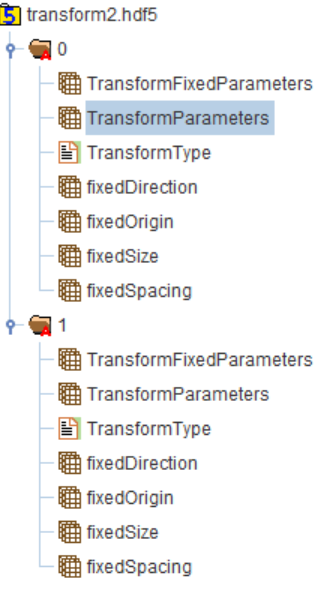

ITK Pairwise Image Registration 
=============

## Group (Subgroup) ##

DREAM3D Review (Registration)

## Description ##

This **Filter** operates on a pair of images or a series of paired images. Specifically, it finds the transform that best aligns a *moving* image to a *fixed* image. This **Filter** uses [ITK's Image Registration Framework](https://itk.org/Doxygen/html/RegistrationPage.html), although only the options shown below are exposed to the user in this **Filter**. The user can select which transformation type, which evaluation metric and which optimizer to use. This **Filter** will output a transformation file in the HDF5 file format. The inputs need to be scalars on an **Image Geometry**. Currently, this filter only works on 2D images. 

If the user selects *Single Pair of Images* for Operation Mode to find the transforms for, the images should be already be in the **Data Container Array** as **Attribute Arrays**, though they do not need to be in the same data container or have the same **Image Geometry**. If the user selects 'Series of Pairs', the user will have to point to the location of both the fixed and moving series of images. In this case, each fixed image must have a moving image counterpart. The images will be paired up by the order they appear in the list. 

A *rigid* transform allows for rotation and translation only. An *affine* transform allows for rotation, translation, scaling and shearing. A *b-spline* transform breaks up the image into polynomial patches defined by the mesh size. The number of control points is the mesh size plus the order of the *b-spline* transform. More information about the *b-spline* transfomration can be found [here](https://itk.org/Doxygen/html/classitk_1_1BSplineTransform.html). 

The evaulation metric provides a measure of how similar the two images being registered to each other are. The options for the metric are Mattes Mutual Information, Mean Squares, or Normalized Cross Correlation.

The optimizers available are LBFGS (Limited Memory Broyden, Fletcher, Goldfarb and Shannon minimization), Gradient Descent and Amoeba (Downhill Simplex). 

This filter currently uses multi-resolution, but does not expose any options to the user to change the paramters. The multi-resolution method performs the registration at a coarse resolution first and then uses finer resolutions up to to original resolution intended to help with speed and accuracy. 

The interpolation method for the registration is currently set to linear. This is only for the registration. The user is free to select linear or nearest-neighbor when actually resampling the data using the ITKResampleImage **Filter**.

The transformation found by this filter is the inverse transformation. That is, for each point on the fixed image, the transformation indicates which moving image point to put in that location. If there isn't an exact moving point to put in that location, the value is determined by the type of interpolation selected. 

The origin and resolution should be set in physical units (microns, mm, anything as long as it's consistent between the two images). If the origin and resolution are the same for the pair (or series of pairs) of images, the user can just leave the box unchecked, and the origin and resolution will be set internally consistent. The resolution is the same as the spacing (i.e. physical units per pixel). 

The transformation file that is written out contains either one or multiple transforms depending on whether a single image or series of images were selected. Figure 1 shows an image in HDFView of the data structure of the transform file. The name of the file is at the very top. Underneath, groups are numbered starting at 0, which represent each pair of images that the registration was run for. If the user only selected 'Single Pair of Images', there would only be one group, titled '0'. Under each group, a number of paramters are stored in datasets. The datasets are described below. The information stored in the Transform HDF5 file is enough to resample an image using the ITKResampleImage **Filter**. 

## Datasets in the Transform HDF5 file
| Name | Type | Description |
|------|------|-------------|
| TransformFixedParameters | Double | The Fixed transform parameters |
| TransformParameters | Double | The learned transform parameters | 
| TransformType | String | The string of the transform type: either *rigid*, *affine*, or *b-spline* |  
| fixedDirection | Double | The direction of the fixed image. More information [here](https://itk.org/Doxygen413/html/classitk_1_1ImageBase.html) | 
| fixedOrigin |  Double |  The origin of the fixed image. More information [here](https://itk.org/Doxygen413/html/classitk_1_1ImageBase.html)  | 
| fixedSize | Int64 | The size in pixels of the fixed image | 
| fixedSpacing | Double | The resolution in length (determined by the user) of the fixed image | 

 

*Figure 1. An image in HDFView of the data structure of the transform file generated by this filter*

## Parameters ##

| Name | Type | Description |
|------|------|-------------|
| Operation Mode  | int | Whether to find the transform for a single pair of images or a series of images |
| Transfomration Type | int | Whether to use a *rigid*, *affine*, or *b-spline* transform |
| Evaluation Metric | int | Whether to use *Mattes Mutual Information*, *Mean Squares*, or *Normalized Cross Correlation* as the similarity metric when registering images|
| Optimizer | int | Choose between *LBFGS*, *Amoeba*, or *Gradient Descent* for the optimizer | 
| Origin/Resolution for Moving and Fixed are Different | bool | If the origin and resolution are the same, they will be set internally. Otherwise, the user must supply the origin and resolution values for each image| 
| B-Spline Order | int | If the *b-spline* registration is chosen, the order of the *b-spline* must be chosen. The values can be either 0, 1, 2 or 3| 
| Mesh Size | int | If the *b-spline* registration is chosen, the mesh size must be set to an integer value. This value is the same in each spatial dimension of the data array. The Mesh Size sets the number of control points. Control Points = Mesh Size + Spline Order| 
| Gradient Convergence Tolerance | float | | 
| Num Max Function Evaluations | int | | 
| Num Iterations | int | | 
| Learning Rate | float | This is only an option for the 'Gradient Descent' choice of Optimizer | 
| Output Transform File | path | The path of the file that the transformation will be written to. It must have a '.hdf5' extension| 
| Initialize Translation With FFT | bool | This option is only available for *rigid* and *affine* transformations. If selected, the translation initial conditions will be found using normalized cross correlation. | 
| Required Fraction of Overlapping Pixels for FFT | float | This option is only available for *rigid* and *affine* transformations if 'Initialize Translation With FFT' is True. This value must be between 0 and 1, and represents the fraction of pixels that, at minimum, must overlap when finding the location of the best normalized cross correlation match for seeding initial conditions for translation. |  
| Fixed Image | **Attribute Array** | If the 'Single Pair of Images' is selected as the Operation Mode, the user must supply the **Attribute Array** that contains the fixed image| 
| Moving Image | **Attribute Array** | If the 'Series of Pairs' option is selected as the Operation Mode, the user must supply the **Attribute Array** that contains the moving image|
| Fixed Image List | | | 
| Moving Image List | | | 
## Example Pipelines ##

## License & Copyright ##

Please see the description file distributed with this plugin.

## DREAM3D Mailing Lists ##

If you need more help with a filter, please consider asking your question on the DREAM3D Users mailing list:
